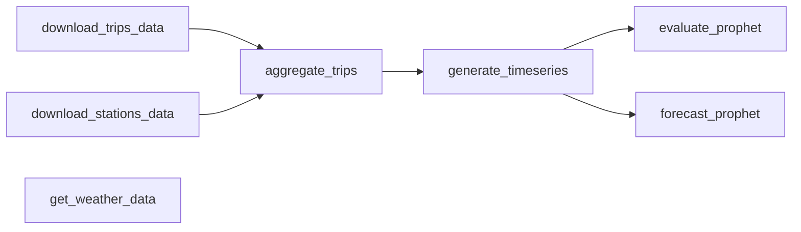

# BlueBikes Forecasting

Medallion-style data pipeline for forecasting morning bike-share demand at Boston BlueBikes stations with Prophet.

> **Part of a two-part BlueBikes study** — this repo covers data engineering and demand forecasting; a companion [station optimization project](#) consumes the forecasts for rebalancing and routing.

<br>

## Overview

A multi-stage pipeline that ingests Boston BlueBikes open data, cleans years of heterogeneous trip records into per-station demand time series, and forecasts daily morning pickup/dropoff demand with Prophet. It is organized as seven independent, runnable tasks (raw → interim → processed → results) plus a set of exploratory notebooks. Every task is invoked the same way: `pixi run python -m bluebikes_forecasting.tasks.<task>`.

### Capabilities

- **Historical trip ingestion**: Download BlueBikes monthly trip archives (≈2018-05 → 2026-03) from the public `hubway-data` S3 bucket, resuming where left off
- **Live station snapshots**: Poll the GBFS API for station metadata and current status; a scheduled GitHub Action (currently paused) accumulated a status time series in git
- **Weather enrichment**: Pull daily Boston-Logan weather from NOAA NCEI, used in the exploratory notebooks to test its predictive power
- **Trip cleaning & aggregation**: Standardize multi-year schemas, drop maintenance/outlier trips, and aggregate to system-daily and per-station-hourly demand
- **Morning-demand time series**: Build gap-filled daily morning pickup/dropoff series per station — the forecasting target
- **Prophet forecasting & backtesting**: Seasonal cross-validation and forward forecasts with 80% prediction intervals and optional rolling retraining

### Output

- **Raw trip & station data** - Monthly trip CSVs and timestamped station-status snapshots
- **Cleaned aggregates** - System-wide daily counts and per-station hourly pickups/dropoffs split by rider and bike type
- **Model-ready time series** - Per-station daily morning-demand series (pickups and dropoffs)
- **Forecasts** - Per-station pickup/dropoff predictions with 80% lower/upper bounds
- **Evaluation artifacts** - Per-split metrics (MAE / RMSE / relative MAE), JSON results, forecast-vs-actual plots, and a cross-station summary

<br>

## Installation

### Prerequisites

- [pixi](https://pixi.sh) (environment & dependency manager — installs Python 3.11 and the full conda-forge stack)
- A free [NOAA NCEI API token](https://www.ncdc.noaa.gov/cdo-web/token) (only needed for `get_weather_data`)

### Steps

1. **Clone the repository**
   ```bash
   git clone https://github.com/jcruz-ferreyra/bluebikes_forecasting.git
   cd bluebikes_forecasting
   ```

2. **Install dependencies**
   ```bash
   pixi install
   ```
   This solves and installs the conda-forge environment defined in [`pixi.toml`](pixi.toml) (Python 3.11) and installs `bluebikes_forecasting` as an editable package.

3. **Set up environment variables**
   ```bash
   cp .env.example .env
   # Edit .env with your paths and token:
   # LOCAL_DIR=/absolute/path/to/your/project/storage   # parent dir that holds data/ and models/
   # DRIVE_DIR=/path/to/drive/storage                   # optional: Google Drive / external storage
   # DATA_FOLDER=data
   # MODELS_FOLDER=models
   # NCEI_APIKEY=your_noaa_ncei_token                    # required only for get_weather_data
   ```
   Paths are resolved in [`config.py`](bluebikes_forecasting/config.py): `LOCAL_DATA_DIR = LOCAL_DIR / DATA_FOLDER` and `LOCAL_MODELS_DIR = LOCAL_DIR / MODELS_FOLDER` (and the `DRIVE_*` equivalents when `DRIVE_DIR` is set and mounted). Under CI (`CI=true`), these default to the repository root so the scheduled Action can run without a `.env`.

4. **Verify installation**
   ```bash
   pixi run python -c "import bluebikes_forecasting; print('Installation successful!')"
   ```

<br>

## Quick Start

Run the tasks in the order below; each builds on the previous stage's outputs. The two Prophet tasks are independent of each other: `evaluate_prophet` works on past data, cross-validating the models for performance reporting, while `forecast_prophet` forecasts future demand and generates the inputs for the subsequent rebalancing-optimization work. `get_weather_data` stands alone: its output is consumed by the exploratory notebooks, not by the pipeline.



### Task 1: [download_trips_data](bluebikes_forecasting/tasks/download_trips_data)

Downloads BlueBikes historical monthly trip files from the public `hubway-data` S3 bucket.

**Configuration**:

Processing Configuration ([`config.yaml`](bluebikes_forecasting/tasks/download_trips_data/config.yaml))

YAML file defining the S3 source and date range to fetch:

```yaml
main_url: "https://s3.amazonaws.com/hubway-data/"
system_name: "bluebikes"   # or "hubway" for older files

start_date: "201805"        # YYYYMM
end_date: "202603"          # YYYYMM

output_storage: "local"     # "local" or "drive"
```

**Run**:
```bash
pixi run python -m bluebikes_forecasting.tasks.download_trips_data
```

**Output** (saved to `LOCAL_DIR/data/raw/trips/` or `DRIVE_DIR/data/raw/trips/`):
- `YYYYMM-bluebikes-tripdata.csv` - One CSV per month in the configured range
- Zips are streamed, extracted, then deleted; months whose CSV already exists are skipped
- Processing logs show per-month download/extract status and a final summary (successful / skipped / failed)

---

### Task 2: [download_stations_data](bluebikes_forecasting/tasks/download_stations_data)

Fetches station metadata and/or current station status from the live GBFS API (Lyft, Boston, v1.1).

**Configuration**:

Processing Configuration ([`config.yaml`](bluebikes_forecasting/tasks/download_stations_data/config.yaml))

YAML file selecting GBFS version and which feeds to pull:

```yaml
version: "1.1"             # only "1.1" is supported

download_metadata: false   # station information + regions (pull occasionally)
download_status: true      # current station status (pull regularly)

output_storage: "local"    # "local" or "drive"
```

**Run**:
```bash
pixi run python -m bluebikes_forecasting.tasks.download_stations_data
```

**Output** (saved under `LOCAL_DIR/data/raw/stations/`):
- `station_information.csv` - Merged station metadata + region names (when `download_metadata: true`)
- `status/station_status_<YYMMDD_HHMMSS>.csv` - Timestamped status snapshot (when `download_status: true`), with a computed `num_classic_available` column
- A scheduled GitHub Action ([`snapshot_stations.yml`](.github/workflows/snapshot_stations.yml)) ran this task ~9× per day to accumulate the status time series in git (the cron is currently paused)

---

### Task 3: [get_weather_data](bluebikes_forecasting/tasks/get_weather_data)

Pulls daily weather observations from the NOAA NCEI API. Built for exploration: the resulting dataset is used in several notebooks to test its predictive power, and has so far been left out of the main pipeline. Requires `NCEI_APIKEY`.

**Configuration**:

Processing Configuration ([`config.yaml`](bluebikes_forecasting/tasks/get_weather_data/config.yaml))

YAML file defining the NCEI dataset, station, variables, and range:

```yaml
dataset: "GHCND"            # Global Historical Climatology Network Daily
station: "USW00014739"      # Boston Logan Airport

datatypes:
  - "TMAX"   # max temperature
  - "TMIN"   # min temperature
  - "PRCP"   # precipitation
  - "SNOW"   # snowfall
  - "SNWD"   # snow depth
  - "AWND"   # average wind speed

start_date: "2018-01-01"    # YYYY-MM-DD
end_date: "yesterday"       # YYYY-MM-DD or "yesterday"

output_storage: "local"     # "local" or "drive"
```

**Run**:
```bash
pixi run python -m bluebikes_forecasting.tasks.get_weather_data
# convenience alias defined in pixi.toml:
pixi run get-weather-data
```

**Output** (saved to `LOCAL_DIR/data/processed/weather/`):
- `daily_weather.csv` - Wide daily table with one column per datatype (`date`, `TMAX`, `TMIN`, …)
- Processing logs show per-year fetch counts and the final shape

---

### Task 4: [aggregate_trips](bluebikes_forecasting/tasks/aggregate_trips)

Loads, cleans, and aggregates all raw trip CSVs into analysis datasets. Requires `station_information.csv` and a stations-of-interest file under `raw/stations/`.

**Configuration**:

Processing Configuration ([`config.yaml`](bluebikes_forecasting/tasks/aggregate_trips/config.yaml))

YAML file defining the station filter and the hourly start date:

```yaml
stations_of_interest_file: "stations_of_interest.json"  # JSON list of station short_name IDs

hourly_start_date: "2023-04-01"   # must be 2023-04-01 or later (new station-ID system)

output_storage: "local"           # "local" or "drive"
```

**Run**:
```bash
pixi run python -m bluebikes_forecasting.tasks.aggregate_trips
```

**Output** (saved to `LOCAL_DIR/data/interim/trip_aggregates/`):
- `daily_aggregates.csv` - System-wide daily trip counts, gap-filled across the full date range (missing days → 0)
- `hourly_station_aggregates.csv` - Per-station hourly pickups and dropoffs for stations of interest, split by `member` (member/casual) and `ebike` (classic/electric)
- Processing logs report rows removed by each cleaning rule

---

### Task 5: [generate_timeseries](bluebikes_forecasting/tasks/generate_timeseries)

Converts the aggregates into model-ready time series, including the per-station morning-demand target.

**Configuration**:

Processing Configuration ([`config.yaml`](bluebikes_forecasting/tasks/generate_timeseries/config.yaml))

YAML file defining the morning rush-hour window:

```yaml
morning_start_hour: 5    # inclusive
morning_end_hour: 11     # exclusive (so 05:00–10:59)

output_storage: "local"  # "local" or "drive"
```

**Run**:
```bash
pixi run python -m bluebikes_forecasting.tasks.generate_timeseries
```

**Output** (saved to `LOCAL_DIR/data/processed/trips/`):
- `system/daily_trips_timeseries.csv` - System-wide daily series (passthrough of `daily_aggregates.csv`)
- `station/<station_id>_morning_demand.csv` - Per-station daily series with `morning_pickups` and `morning_dropoffs` (gaps → 0) — the forecasting target
- Processing logs show station counts and date ranges

---

### Task 6: [evaluate_prophet](bluebikes_forecasting/tasks/evaluate_prophet)

Backtests Prophet per station across seasonal cross-validation splits — performance reporting on past data.

**Configuration**:

Processing Configuration ([`config.yaml`](bluebikes_forecasting/tasks/evaluate_prophet/config.yaml))

YAML file defining the test windows and retraining cadence:

```yaml
test_split_start_dates:    # seasonal test-window starts
  - "2025-04-01"  # spring
  - "2025-07-01"  # summer
  - "2025-10-01"  # fall
  - "2026-01-01"  # winter

test_split_days: 60        # length of each test window (incl. start date)

retrain_every_days: 7      # retrain every N days within a window (0 = train once)

output_storage: "local"    # "local" or "drive"
```

**Run**:
```bash
pixi run python -m bluebikes_forecasting.tasks.evaluate_prophet
```

**Output** (saved to `LOCAL_DIR/data/timeseries_results/evaluation/prophet/`):
- `evaluation_summary.csv` - Flattened metrics across every station and split
- `<station_id>/<station_id>_evaluation.json` - Per-split actuals, predictions, errors, and metrics
- `<station_id>/<station_id>_metrics_summary.csv` - Per-split metrics plus an average row
- `<station_id>/split_<N>_{pickups,dropoffs}.png` - Forecast-vs-actual plots

---

### Task 7: [forecast_prophet](bluebikes_forecasting/tasks/forecast_prophet)

Trains Prophet and generates forward forecasts (with 80% bounds) for every station — the inputs for the subsequent rebalancing-optimization work.

**Configuration**:

Processing Configuration ([`config.yaml`](bluebikes_forecasting/tasks/forecast_prophet/config.yaml))

YAML file defining the inference window, retraining, and model persistence:

```yaml
inference_start_date: "2026-03-01"  # YYYY-MM-DD — start of the forecast horizon
inference_end_date: "end_of_data"   # YYYY-MM-DD or "end_of_data"

retrain_every_days: 7               # retrain every N days (0 = train once)

save_models: false                  # true → pickle the trained Prophet models

output_storage: "local"             # "local" or "drive"
```

**Run**:
```bash
pixi run python -m bluebikes_forecasting.tasks.forecast_prophet
```

**Output** (saved to `LOCAL_DIR/data/timeseries_results/forecasts/prophet/`):
- `<station_id>_forecast.csv` - Daily `pickups_forecast` / `dropoffs_forecast` plus `*_lower` / `*_upper` 80% bounds
- `MODELS_DIR/prophet/<station_id>_{pickups,dropoffs}_trained_<date>.pkl` - Pickled models (only when `save_models: true`)
- Processing logs show per-station training windows and forecast lengths

<br>

## Bonus: [Analysis Notebooks](notebooks/)

Jupyter notebooks for exploration, diagnostics, and model experimentation. The notebook toolchain (JupyterLab, ipykernel) and the modelling libraries live in the **`dev`** environment; the `lab` and `kernel` tasks are defined there, so a bare `pixi run` picks it automatically:

```bash
pixi run lab       # launch JupyterLab (provisions the dev environment on first run)
pixi run kernel    # one-time: register the "Pixi (bluebikes_forecasting)" kernel for VS Code / Jupyter
```

**Flow** (`notebooks/`):
- `00_trips_eda` - Exploratory analysis of raw trip data
- `01_daily_aggregate_eda` / `01_hourly_aggregate_eda` - Explore the daily and hourly aggregates
- `02_stationarity_test` - Stationarity diagnostics on the demand series
- `03_get_weather_data` - Weather retrieval and exploration
- `04_classical_model_selection` - Classical time-series model selection
- `05_classical_model_training` / `05_prophet_model_training` / `05_xgboost_model_training` / `05_bayesian_model_training` - Model-training experiments
- `06_challenge_variance` - Investigation of demand variance

**Bayesian modelling libraries.** The `dev` environment bundles the libraries used by `05_bayesian_model_training` — [PyMC](https://www.pymc.io/), [nutpie](https://github.com/pymc-devs/nutpie) (a fast NUTS sampler), and [ArviZ](https://python.arviz.org/) (posterior diagnostics). They are installed from conda-forge so PyTensor and nutpie get working compiled backends without manual compiler setup; no extra steps are needed beyond launching `pixi run lab` or selecting the registered kernel.

<br>

## Structure

### Source Layout

```
bluebikes_forecasting/
├── bluebikes_forecasting/              # source package
│   ├── config.py                    # resolves data/model paths + NCEI key from .env (CI-aware)
│   ├── plots/
│   │   └── plots.py                 # shared plotting helpers (COLORS, plot_daily_longterm, …)
│   ├── utils/
│   │   ├── logging.py               # setup_logging()
│   │   └── yaml_config.py           # load_config(), check_missing_keys()
│   └── tasks/                       # seven runnable pipeline stages
│       ├── download_trips_data/
│       ├── download_stations_data/
│       ├── get_weather_data/
│       ├── aggregate_trips/
│       ├── generate_timeseries/
│       ├── evaluate_prophet/
│       └── forecast_prophet/
├── notebooks/                       # exploratory analysis & model experiments (00 → 06)
├── data/                            # CCDS data dirs (real data lives under LOCAL_DIR / DRIVE_DIR)
├── models/                          # serialized models (e.g. prophet/*.pkl)
├── reports/figures/                 # generated figures
├── .github/workflows/
│   └── snapshot_stations.yml        # cron Action: runs download_stations_data (paused)
├── pixi.toml                        # conda-forge environment, features & tasks
├── pixi.lock
└── pyproject.toml                   # packaging metadata (flit)
```

Each task folder follows a consistent structure:

```
download_trips_data/
├── __init__.py                 # exports the Context dataclass + entry function
├── __main__.py                 # entry point — loads config.yaml, builds the Context, runs the task
├── config.yaml                 # task parameters
├── types.py                    # Context dataclass: validation + computed I/O paths
└── download_trips_data.py      # core logic (with module-level helper functions)
```

### Context Pattern

`types.py` is each task's **contract**. Its `__post_init__` validates the YAML config (storage option, date formats, value ranges), and its `@property` methods compute — and create on access — every input/output path. The data layout below is therefore defined literally by those properties.

```python
@dataclass
class AggregateTripsContext:
    # --- config (from config.yaml) ---
    stations_of_interest_file: str
    hourly_start_date: str            # YYYY-MM-DD
    output_data_dir: Path             # LOCAL_DATA_DIR or DRIVE_DATA_DIR
    output_storage: str = "local"

    def __post_init__(self):
        self.output_data_dir.mkdir(parents=True, exist_ok=True)
        _validate_storage(self.output_storage)
        _validate_hourly_start_date(self.hourly_start_date)   # must be ≥ 2023-04-01
        _validate_stations_file(self.stations_of_interest_path)

    # --- computed I/O paths ---
    @property
    def raw_trips_dir(self) -> Path:              # input
        return self.output_data_dir / "raw" / "trips"

    @property
    def station_metadata_path(self) -> Path:      # input
        return self.output_data_dir / "raw" / "stations" / "station_information.csv"

    @property
    def processed_dir(self) -> Path:              # output (created on access)
        path = self.output_data_dir / "interim" / "trip_aggregates"
        path.mkdir(parents=True, exist_ok=True)
        return path
```

This pattern provides:
- Centralized configuration and path state per task
- Automated, single-source path computation via `@property` decorators
- Validation and normalization in `__post_init__` (e.g. trailing-slash fixes, date checks)
- A clean split between user-facing config (`config.yaml`) and on-disk layout

### Data Layout

Produced by the pipeline under the storage directory (`LOCAL_DIR/DATA_FOLDER`, i.e. `data/`; or `DRIVE_DIR/DATA_FOLDER` when `output_storage: "drive"`):

```
data/
├── raw/
│   ├── trips/
│   │   └── YYYYMM-bluebikes-tripdata.csv            # download_trips_data
│   └── stations/
│       ├── station_information.csv                  # download_stations_data (metadata)
│       ├── status/
│       │   └── station_status_<YYMMDD_HHMMSS>.csv   # download_stations_data (status)
│       └── stations_of_interest.json                # manual input (station short_name IDs)
├── interim/
│   └── trip_aggregates/                             # aggregate_trips
│       ├── daily_aggregates.csv
│       └── hourly_station_aggregates.csv
├── processed/
│   ├── trips/
│   │   ├── system/daily_trips_timeseries.csv        # generate_timeseries
│   │   └── station/<station_id>_morning_demand.csv  # generate_timeseries
│   └── weather/
│       └── daily_weather.csv                        # get_weather_data
└── timeseries_results/
    ├── evaluation/prophet/                          # evaluate_prophet
    │   ├── evaluation_summary.csv
    │   └── <station_id>/{<id>_evaluation.json, <id>_metrics_summary.csv, split_<N>_*.png}
    └── forecasts/prophet/
        └── <station_id>_forecast.csv                # forecast_prophet

models/                                              # = LOCAL_DIR/MODELS_FOLDER
└── prophet/
    └── <station_id>_{pickups,dropoffs}_trained_<date>.pkl   # forecast_prophet (save_models)
```

<br>

## How It Works

### Task 1: [download_trips_data](bluebikes_forecasting/tasks/download_trips_data)

Downloads BlueBikes public historical trip files from the `hubway-data` S3 bucket with resume capability and dual URL-pattern handling.

<details>
<summary><b>Details</b></summary>
<br>

**Processing Pipeline**:
1. Date Range Generation
   - Expand `start_date` → `end_date` (YYYYMM) into a list of months via `relativedelta`
2. Per-Month Resolve & Download
   - Skip the month if its CSV already exists in `raw/trips/`
   - HEAD-probe two URL patterns: `YYYYMM-bluebikes-tripdata.zip`, then fall back to `…-tripdata.csv.zip`
   - Stream the chosen zip in 8 KB chunks with a `tqdm` progress bar
3. Extract & Clean Up
   - Unzip the archive into `raw/trips/`, then delete the zip
4. Summary
   - Tally successful / skipped / failed months and log it

**Key Features**:
- **Resume capability**: Months whose CSV is already present are skipped
- **Dual URL patterns**: Handles both BlueBikes naming conventions, probed via HTTP HEAD
- **Streaming download**: Chunked transfer with progress; HTTP 404s are logged as warnings, not fatal errors
- **Local or Drive output**: Selected by `output_storage`

**Technical Details**:
- URLs are built from `main_url` + `system_name`; `main_url` is normalized to end with `/`
- Output directory `raw/trips/` is created on first access by the Context

</details>

---

### Task 2: [download_stations_data](bluebikes_forecasting/tasks/download_stations_data)

Calls the live GBFS API (Lyft / Boston, v1.1) for station metadata and current status; also the task behind the snapshot Action.

<details>
<summary><b>Details</b></summary>
<br>

**Processing Pipeline**:
1. Mode Selection
   - Run `metadata` and/or `status` based on the `download_metadata` / `download_status` flags (at least one must be enabled)
2. Metadata
   - Fetch `station_information.json` and `system_regions.json`
   - Keep the v2.3-compatible fields, merge region names onto stations, write `station_information.csv`
3. Status
   - Fetch `station_status.json`, keep the relevant fields
   - Add `num_classic_available = num_bikes_available − num_ebikes_available`
   - Write `status/station_status_<UTC timestamp>.csv`

**Key Features**:
- **GBFS v1.1 endpoints**: Derived from `version` for the Boston (`bos`) feed
- **Selective download**: Metadata pulled occasionally, status pulled regularly
- **Scheduled accumulation**: The cron Action ran the status mode ~9× per day, committing each snapshot to build a status time series in git (currently paused)

**Technical Details**:
- Endpoints: `https://gbfs.lyft.com/gbfs/1.1/bos/en/{station_information,system_regions,station_status}.json`
- Timestamps use UTC, formatted `%y%m%d_%H%M%S`
- Only version `"1.1"` is accepted (validated in `types.py`)

</details>

---

### Task 3: [get_weather_data](bluebikes_forecasting/tasks/get_weather_data)

Pulls daily Boston weather from NOAA NCEI and reshapes it into a wide daily table for the notebooks.

<details>
<summary><b>Details</b></summary>
<br>

**Processing Pipeline**:
1. Date Parsing
   - Parse `start_date`; resolve `end_date` (`"yesterday"` → today − 1 day)
2. Year-by-Year Fetch
   - Query the NCEI `/data` endpoint per calendar year, paginating in pages of 1000 records (`offset`)
3. Resilience
   - Retry HTTP 503s with exponential backoff (1 s / 2 s / 4 s); 0.2 s delay between pages to avoid rate limiting
4. Reshape & Save
   - Pivot the long records to a wide daily table (one column per datatype) and write `processed/weather/daily_weather.csv`

**Key Features**:
- **NCEI GHCND, Boston Logan** (`USW00014739`)
- **Six datatypes**: TMAX, TMIN, PRCP, SNOW, SNWD, AWND
- **Standalone task**: Not part of the main pipeline (see note)

**Technical Details**:
- Auth via the `NCEI_APIKEY` token header; `units="standard"`
- Raises if no records are returned (bad station, dataset, or token)

> **Note (current design)**: This task was built for exploration — the weather dataset it produces is used in several notebooks (e.g. the XGBoost / Bayesian experiments) to test its predictive power for demand. The Prophet tasks model seasonality using only built-in US holidays, with no weather regressors, so up to now `get_weather_data` has been left out of the main pipeline. This is the current state, not a limitation.

</details>

---

### Task 4: [aggregate_trips](bluebikes_forecasting/tasks/aggregate_trips)

The cleaning core: standardizes years of trip data, removes bad records, and produces system-daily and per-station-hourly aggregates.

<details>
<summary><b>Details</b></summary>
<br>

**Processing Pipeline**:
1. Load & Prepare
   - Read every CSV in `raw/trips/`, rename heterogeneous columns to a common schema, parse datetimes, concatenate into one frame
2. Load Station Metadata
   - Read `station_information.csv`; build the set of valid IDs (union of `station_id` and `short_name`)
3. Clean
   - Drop trips at maintenance stations (unknown IDs starting with `X`)
   - Compute duration; drop trips < 1 min or > 120 min; drop same-station < 3 min "false starts"
4. Daily Aggregates
   - Group by date → `trip_count`; reindex to the complete date range, filling missing days with 0
5. Hourly Station Aggregates
   - From `hourly_start_date`, for stations of interest: count pickups (by start station) and dropoffs (by end station) per `date × hour × member × ebike`, outer-merge, fill 0

**Key Algorithms**:
- **Schema standardization**: A column-name map reconciles the trip-file format changes across years
- **Maintenance-station detection**: Unknown IDs prefixed with `X` are treated as maintenance and dropped
- **Outlier rules**: Duration bounds plus same-station short-trip false-start removal

**Technical Details**:
- `member` flag = `member_casual == "member"`; `ebike` flag = `rideable_type == "electric_bike"`
- `hourly_start_date` must be ≥ 2023-04-01 (the new station-ID scheme), enforced in `types.py`
- Outputs land in `interim/trip_aggregates/`

</details>

---

### Task 5: [generate_timeseries](bluebikes_forecasting/tasks/generate_timeseries)

Turns the aggregates into clean, gap-filled series, including the per-station morning-demand target.

<details>
<summary><b>Details</b></summary>
<br>

**Processing Pipeline**:
1. System Series
   - Copy `daily_aggregates.csv` through to `processed/trips/system/daily_trips_timeseries.csv`
2. Load Hourly Aggregates
   - Read `hourly_station_aggregates.csv` and parse dates
3. Build Per-Station Hourly Series
   - Sum across `member` / `ebike` categories per station; reindex to a complete hourly range, filling gaps with 0
4. Morning Demand
   - Filter to hours ≥ `morning_start_hour` and < `morning_end_hour` (end exclusive); sum per day into `morning_pickups` / `morning_dropoffs`; reindex to all dates (gaps → 0)
5. Save
   - Write one `<station_id>_morning_demand.csv` per station

**Key Features**:
- **Configurable morning window**: Start inclusive, end exclusive; default 5 → 11, i.e. 05:00–10:59
- **Complete series**: Gap-filled hourly and daily series, friendly to forecasting models

**Technical Details**:
- `timestamp = date + hour`, grouped per `station_id`
- Outputs land in `processed/trips/{system,station}/`

</details>

---

### Task 6: [evaluate_prophet](bluebikes_forecasting/tasks/evaluate_prophet)

Backtests Prophet on each station's morning demand across seasonal cross-validation splits.

<details>
<summary><b>Details</b></summary>
<br>

**Processing Pipeline**:
1. Discover Station Files
   - Glob `*_morning_demand.csv` in `processed/trips/station/`
2. Per Station, Per Split
   - For each `test_split_start_date`: train on data before the split start, then forecast the `test_split_days`-long test window
3. Retraining
   - If `retrain_every_days > 0`, roll training forward every N days within the window; otherwise train once and forecast the whole window
4. Metrics
   - Compute MAE, RMSE, actual mean, and relative MAE separately for pickups and dropoffs
5. Persist
   - Per-station JSON, a metrics CSV (with an average row), and forecast-vs-actual PNGs; plus a cross-station `evaluation_summary.csv`

**Key Algorithms**:
- **Separate pickups/dropoffs models**: Prophet with multiplicative seasonality, yearly + weekly seasonality (daily off), US holidays, `interval_width = 0.80`
- **Walk-forward CV**: Per-season test windows with optional rolling retraining

**Technical Details**:
- Per-station outputs go to `timeseries_results/evaluation/prophet/<station_id>/`
- Relative MAE is `MAE / actual_mean` (null when the actual mean is 0)

</details>

---

### Task 7: [forecast_prophet](bluebikes_forecasting/tasks/forecast_prophet)

Production forecasting: trains Prophet and projects pickups/dropoffs forward with 80% prediction intervals.

<details>
<summary><b>Details</b></summary>
<br>

**Processing Pipeline**:
1. Load Station Series
   - Load all `*_morning_demand.csv`; validate that `inference_start_date` is not after the last available date
2. Determine Horizon
   - From `inference_start_date` to `inference_end_date` (or `end_of_data`)
3. Train & Forecast
   - Train once on data before the start (`retrain_every_days = 0`), or roll forward every N days; predict `yhat` plus 80% bounds for pickups and dropoffs
4. Optional Persistence
   - Pickle each trained model when `save_models: true`
5. Save
   - Write one combined `<station_id>_forecast.csv` per station

**Key Features**:
- **Consistent model config**: Same Prophet settings as evaluation, so backtest and production agree
- **Prediction intervals**: `*_lower` / `*_upper` columns at the 80% interval
- **Optional rolling retrain and model persistence**

**Technical Details**:
- Forecast columns: `station_id`, `ds`, `pickups_forecast` / `pickups_lower` / `pickups_upper`, and the `dropoffs_*` equivalents
- Saved models (when enabled): `MODELS_DIR/prophet/<station_id>_{pickups,dropoffs}_trained_<date>.pkl`

</details>

<br>

## 👥 Contributors
<!-- Add one entry per contributor:
<a href="https://github.com/USERNAME"></a>
-->
<a href="https://github.com/jcruz-ferreyra"></a>

<br>

## Additional Resources

### Related Technologies

- **[Prophet](https://facebook.github.io/prophet/)** - Forecasting model used for the per-station demand models
- **[GBFS / Lyft BlueBikes feed](https://gbfs.lyft.com/gbfs/1.1/bos/en/gbfs.json)** - Live station metadata and status
- **[NOAA NCEI GHCND](https://www.ncei.noaa.gov/cdo-web/)** - Daily weather observations (Climate Data Online API)
- **[BlueBikes System Data](https://bluebikes.com/system-data)** - Public historical trip data (`hubway-data` S3 bucket)
- **[Cookiecutter Data Science](https://cookiecutter-data-science.drivendata.org/)** - Project template this layout is based on

### Support

For questions or issues:
- **GitHub Issues**: [bluebikes_forecasting/issues](https://github.com/jcruz-ferreyra/bluebikes_forecasting/issues)

### Citation

If you use this pipeline in your research, please cite:
```bibtex
@software{bluebikes_forecasting_2026,
  title       = {BlueBikes Forecasting: Demand Forecasting for Boston Bike-Share Stations},
  author      = {Ferreyra, Juan Cruz},
  institution = {Northeastern University},
  year        = {2026},
  url         = {https://github.com/jcruz-ferreyra/bluebikes_forecasting}
}
```

### License

MIT License - see [LICENSE](LICENSE) file for details.
